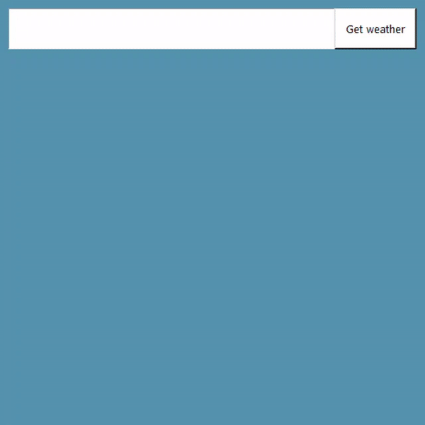

# Weather App





GUI weather app made in Tkinter that uses requests to connect to Openweathermap API, parse JSON information and instantly display weather information for a given city. Run weatherapp.py to run the app, enter the city and click 'Get weather' to show weather!


Note: This script depends on requests, so make sure you have it installed using:


```
pip install requests
```